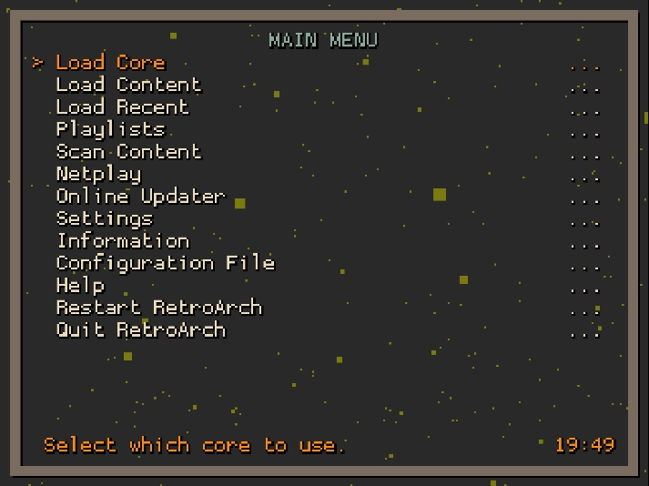

# RetroArch 1.66x filter

This is the 1.19.1 build of RetroArch for Miyoo (Pocket Go, PowKiddy Q90/V90, New BittBoy) with the addition of the 1.66x upscale filter.

Recommended especially for Gameboy and Gameboy Color emulation. In these cases, the screen resolution of the device makes the GB/GBC image look bad without this filter. It is the same filter used in Gambatte-dms.

## Socials

The links below belong to our official channels of RetroArch and Gambatte-dms.

- [RetroArch] https://github.com/libretro/RetroArch
- [Gambatte-dms] https://github.com/bardeci/gambatte-dms
